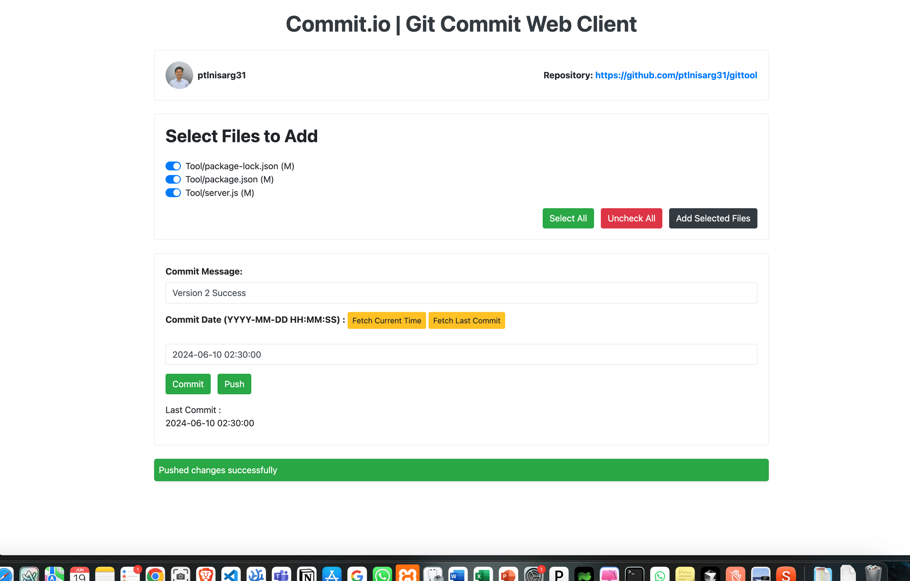

##  ControlGit Client - Frontend | Git Commit web client 

  
   [ 👨‍💻 User Interface - Web UI ]

## Live Demo

- **Frontend Live Hosted**: [git.nisargpatel.studio](https://git.nisargpatel.studio/) / [commit-it.vercel.app](https://commit-it.vercel.app/)
- **Frontend Repo**: [https://github.com/ptlnisarg31/commit.it](https://github.com/ptlnisarg31/commit.it)

## Overview
This project is a web-based application that interacts with a backend server to fetch and display GitHub user profiles, repository information, and manage file changes. It provides functionalities such as adding files, committing changes, and pushing changes to a repository.

## Features
- **Dynamic Backend URL Configuration**: Users can set the backend URL through a prompt when the application loads for the first time or if it's not already set.
- **GitHub Profile and Repository Display**: Fetches and displays GitHub user profile and repository information.
- **File Management**: Lists changed files and allows users to select files to add to a commit.
- **Commit Functionality**: Users can commit changes with a custom commit message and date.
- **Push Functionality**: Allows users to push changes to the repository.
- **Notifications**: Displays success and error notifications based on the operations performed.

## Setup
1. Clone the repository.
2. Navigate to the project directory.
3. Open the `index.html` file in a browser to run the application.

## Usage
- **Setting Backend URL**: Automatically prompted to enter the backend URL if not set.
- **Viewing GitHub Information**: Automatically fetches and displays GitHub user and repository information on load.
- **Managing Files**: Use the interface to select files and commit changes.
- **Committing Changes**: Enter a commit message and date, then submit the form to commit changes.
- **Pushing Changes**: Click the "Push" button to push changes to the repository.

## Dependencies
- The project requires a backend server running at the specified URL to handle API requests.
- Ensure that the backend supports the endpoints used in the application (`/github-profile`, `/github-repo`, `/changed-files`, `/add-files`, `/commit`, `/push`, `/last-commit-date`).

## Additional Notes
- The application uses session storage to remember the backend URL across sessions.
- Error handling is implemented for all fetch operations to ensure the application can gracefully handle and report errors.
